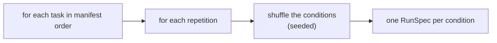

# Campaigns and planning

`experiments/campaign.py` turns a YAML recipe into a grid of runs, executes them, and writes a study. It is the largest module in the engine.

## Loading and validating a config

`load_campaign()` reads the YAML and refuses, with a clear error, when:

- the `schema_version` isn't supported,
- the `backend` isn't `scripted` or `ollama`,
- two conditions share an id, or none are declared,
- a condition asks for a composition policy other than `shared` (the others arrive in Phase 3),
- the `ollama` backend has no `model.id`,
- a **live** campaign has no `preregistration:` file, or the declared file is missing.

The whole file's text is hashed into `config_hash`. Every relative path in the config (`dataset.manifest`, `skills_root`, `graders_root`, `scripted_transcripts`, `preregistration`) resolves against the config file's own directory. See the [full key reference](../reference/campaign-config.md).

## Planning the runs

`plan_runs()` builds one `RunSpec` per **task x condition x repetition**:

- A single `random.Random(schedule_seed)` drives every shuffle, so **the order looks random but is exactly reproducible** from the seed and the manifest.
- Run ids are sequential across the whole plan: `<study>-r0001`, `<study>-r0002`, ...
- Each `RunSpec` records the task identity (including prompt, starter-tree and grader hashes), the ordered skill package hashes, the model spec, the stage plan (one `implement` stage), and the environment identity.
- A condition naming an unknown skill fails planning with the list of available skills.

The **study id** defaults to `<campaign name>-<first 8 hex chars of the config hash>`, or use `--study-id`.

`squelch plan` prints all of this, plus a conservative token envelope, *without contacting a model or running task code*.

## Executing

For each planned run, in order:

1. If `--resume`, try to reuse a prior result (below).
2. If the token budget is already exhausted, record a `not_run_budget` result instead of running.
3. Otherwise build the backend, call `execute_run()`, and charge the run's tokens to the ledger.
4. Write `run_spec.json` and `result.json` immediately, so a crash never loses completed work.
5. If a run was `interrupted`, stop the campaign and keep partial artifacts.

Finally the study summary is written to `study.json`.

For the `ollama` backend the driver first probes the server (`/api/version`) and prints the version, so an unreachable server fails fast rather than producing 48 `invalid` runs.

## The token budget

`budget.max_total_input_tokens` and `budget.max_total_output_tokens` are cumulative caps across the campaign. Before dispatching each run the ledger asks "is either cap already reached?" and, if so, the remaining runs become `not_run_budget`.

:::note Two honest details
- The check happens **between runs**, so a campaign can overshoot a cap by up to one run's worth of tokens. It is not a per-request reservation.
- There is **no USD ledger**. Local inference has zero marginal cost, recorded as `pricing_reference: local_inference_zero_marginal_cost`. A future paid backend stays `cost_unknown` until a price table exists, and can't claim a dollar cap. This is pinned by a test.
:::

`not_run_budget` cells are persisted and reported as incomplete. **A missing run must never look like a pass.**

## Resume

`--resume` reuses a prior run only when *all* of these hold:

- the run directory has both `run_spec.json` and `result.json`,
- the stored spec is identical to the freshly planned one (ignoring only the `created_at` timestamp),
- the stored result parses and its status is `completed` or `agent_limit`.

Anything else (missing files, corrupt JSON, a changed spec, an `invalid` or `interrupted` prior result) is **re-run, not trusted**. Cached results are never pooled as extra independent trials: a reused run is the *same* run.

Two more guards:

- Re-running a study id that already exists **without** `--resume` is refused ("results are immutable").
- Resuming with a **different config** is refused ("changed manifests require new studies").

This was exercised for real: the second pilot attempt was interrupted at run 3 and resumed, reusing the two completed runs and re-running the half-finished one.

## The study summary

`study.json` holds: the config hash, backend, model id, evidence stage, environment identity, runner version, preregistration hash, status counts, reused-run count, token totals, per-cell success counts, per-condition verbosity diagnostics, fixture provenance, and a disclosure sentence. Field-by-field detail is in [artifacts](../reference/artifacts.md).

The disclosure sentence changes with the evidence: scripted studies say they validate the harness only; live studies say they describe this runner and model; a study that includes a constructed fixture adds an explicit warning naming it.
