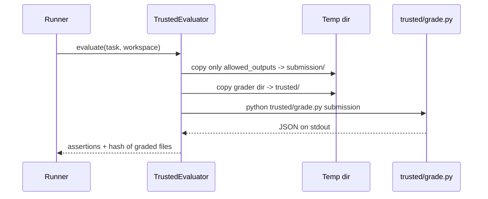

# Trusted evaluation

The grader decides pass or fail, so it is deliberately paranoid about not trusting the agent's workspace. It lives in `sandbox/evaluator.py`; the graders themselves are under `fixtures/graders/`.

## The contract

- **The agent never sees the grader.** Grader code is never mounted into the agent's workspace and isn't reachable through any tool.
- **Only declared outputs are graded.** Each task lists `allowed_outputs` as glob patterns. Only files matching them are copied out of the agent's workspace. A sneaky extra file simply isn't copied.
- **Grading happens in a fresh directory.** Squelch creates a temporary directory containing `submission/` (the copied outputs) and `trusted/` (a copy of the task's grader), and runs the grader there.
- **Symlinks in outputs are refused.** A symlink among the allowed outputs raises an evaluation error.

## How a grade is produced



The grader must print exactly one JSON document:

```json
{"assertions": [
  {"id": "config-exists", "passed": true,  "mandatory": true, "detail": ""},
  {"id": "port-valid",    "passed": false, "mandatory": true, "detail": "port: 80"}
]}
```

`mandatory` defaults to `true`. **A task succeeds only if every mandatory assertion passes** (`task_success()` in the evaluator).

## When grading itself fails

Any of these raises `EvaluationError` and the run becomes **`invalid`**, never a scored failure:

- the grader times out (using the task's `task_timeout_seconds`),
- it exits non-zero,
- its output isn't parseable JSON in the expected shape,
- it returns zero assertions,
- a symlink was found among the outputs,
- the grader directory or its `grade.py` is missing.

All of these are covered in [`tests/unit/test_evaluator.py`](https://github.com/kshesha1/Squelch/blob/main/tests/unit/test_evaluator.py), including a test that plants a fake `grade.py` in the agent's workspace and confirms it is neither copied nor executed.

## Tasks that depend on a library

Where a task involves a library, the grader imports **its own instrumented copy** rather than the agent's. The `api-migration` grader ships a `toylib.py` that records every call, so it can verify the agent really passed a 5-second timeout instead of trusting the agent's code.

## Calibration: graders must be passable *and* discriminating

[`test_grader_calibration.py`](https://github.com/kshesha1/Squelch/blob/main/tests/integration/test_grader_calibration.py) pins three properties for the harder `v2` tasks, using hidden reference solutions kept under `tests/fixtures/`:

1. a known-correct reference **passes** every mandatory assertion,
2. the untouched starter does **not** pass,
3. the starter passes *some* assertions, so the grader gives partial signal rather than all-or-nothing.

## Honest limitation

Trusted grading protects the *verdict* from the agent. It does not sandbox the *execution*: with `LocalEnv`, the grader imports and runs agent-written code on the host. See [tools and sandbox](./tools-and-sandbox.md).
