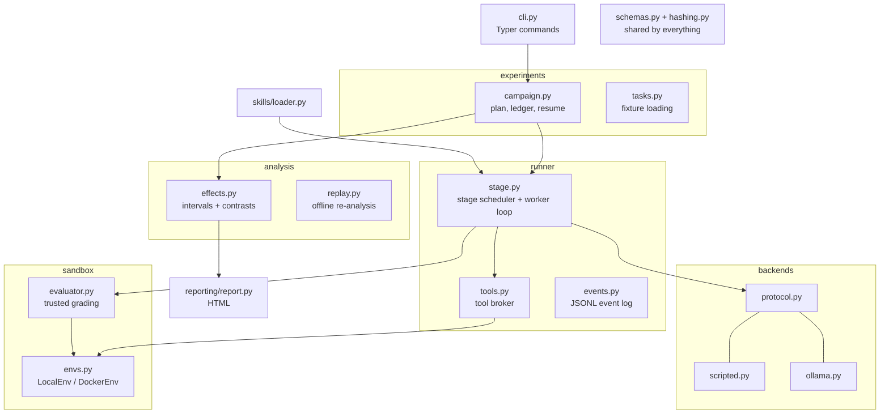

# Architecture overview

About 3,500 lines of Python, organised so that each folder has one job.



## Module map

| Path | Responsibility | Page |
|---|---|---|
| `cli.py` | The command-line front door. Routes to the modules below. | [CLI reference](../reference/cli.md) |
| `experiments/campaign.py` | Parse a campaign, plan runs, enforce the token budget, resume, summarise | [Campaigns](./campaigns.md) |
| `experiments/tasks.py` | Load task fixtures and manifests, bind identity hashes | [Write a task](../guides/write-a-task.md) |
| `runner/stage.py` | Stage scheduler, the agent loop, limits, workspace diff, `execute_run` | [Runner](./runner.md) |
| `runner/tools.py` | The four tools and the path-safety rules | [Tools and sandbox](./tools-and-sandbox.md) |
| `runner/events.py` | Append-only JSONL event log | [Data contracts](./data-contracts.md) |
| `sandbox/envs.py` | Where commands actually run: `LocalEnv` or `DockerEnv` | [Tools and sandbox](./tools-and-sandbox.md) |
| `sandbox/evaluator.py` | Grade final artifacts in a fresh directory with trusted code | [Evaluation](./evaluation.md) |
| `backends/` | The model interface and its two implementations | [Backends](./backends.md) |
| `skills/loader.py` | Parse skill packages and fingerprint every file | [Write a skill](../guides/write-a-skill.md) |
| `analysis/effects.py` | Wilson intervals and four-condition contrasts | [Analysis](./analysis.md) |
| `analysis/replay.py` | Re-derive run labels from recorded events | [Analysis](./analysis.md#replay-offline-re-analysis) |
| `reporting/report.py` | Self-contained HTML report | [Reporting](./reporting.md) |
| `schemas.py`, `hashing.py` | Pydantic data contracts and canonical hashing | [Data contracts](./data-contracts.md) |

## Repository layout

```text
src/squelch/          # the engine
fixtures/
  skills/             # skill packages under test
  tasks/              # prompt + starter files + task manifest
  graders/            # trusted graders; never agent-visible
  campaigns/          # experiment recipes + scripted transcripts
tests/
  unit/  integration/ # ~110 keyless tests + Docker-marked boundary tests
  fixtures/           # hidden reference solutions for grader calibration
examples/
  demo/               # offline reports and replay data
  pilot-001/          # raw results of the first live pilot
docs/                 # this documentation (also rendered on GitHub)
website/              # the Docusaurus site that presents docs/
```

## Design principles

**Observation is separate from classification.** The recorded events are the observation; labels like `completed` or `agent_limit` are derived from them. When a label rule turns out to be wrong you can fix the rule and re-derive, without re-running anything. That is what [`replay`](./analysis.md#replay-offline-re-analysis) exists for.

**Artifacts are immutable.** A study directory is written once. A study id that already exists is refused unless you pass `--resume`, and a resumed study must have the identical config. Re-analysis writes a *new* derived study.

**The stage scheduler is the general case.** A run executes a *stage plan* of length *n*. Phase 1 uses *n* = 1, but nothing special-cases that, so multi-stage composition policies (Phase 3) slot in without restructuring the runner. A scripted two-stage run is already tested.

**One interface, many brains.** The runner talks to a `ModelBackend` protocol. The scripted backend, the Ollama backend, and any future hosted backend are interchangeable.

**Fail toward `invalid`, never toward a fake result.** A grader that crashes, times out, or emits garbage makes the run `invalid`. It is never scored as an ordinary failure.

**Identity is content.** Skills, tasks, graders, configs and preregistrations are all identified by hashes of their exact contents, so a result is provably tied to the version that produced it.
