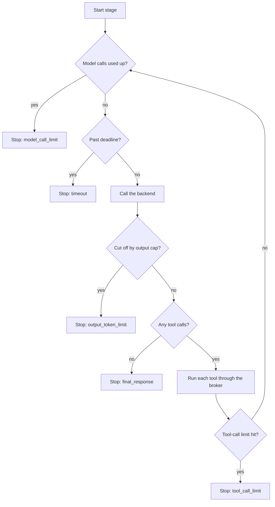

# The runner

`runner/stage.py` is where an agent actually "works". `execute_run()` performs one run end to end; the `StageScheduler` inside it executes the stage plan.

## `execute_run`, step by step

1. **Reset the workspace.** Delete any previous workspace for this run id and copy the task's `starter/` tree into a fresh one.
2. **Open the event log** and emit `run_started` (condition, task, repetition, backend, environment, stage count).
3. **Run the stage plan** through the scheduler (below).
4. **Handle failure.** A backend failure ends the run as `invalid` (termination `backend_error`). A `KeyboardInterrupt` ends it as `interrupted`.
5. **Grade** the final workspace with the [trusted evaluator](./evaluation.md). If the evaluator itself fails, the run is `invalid`, not a failure.
6. **Diff** the workspace against the starter tree and write `diff.patch` plus an `A`/`M`/`D` change list.
7. **Classify.** If the loop ended for any reason other than a normal final response, the status is `agent_limit` and `task_success` is forced to `false`. Otherwise `completed`.
8. Emit `evaluation_completed` and `run_finished`, and return a `RunResult`.

Grading runs even for `agent_limit` runs, so the workspace state is still recorded.

## The stage scheduler

A **stage plan** is a list of `StageSpec` entries. Each stage gets:

- its own **worker id** (`worker-1`, `worker-2`, ...),
- a **fresh message context** (only the task prompt),
- its own forced list of exposed skills,
- its own limits.

The **workspace persists** across stages of one run. If any stage ends for a reason other than `final_response`, later stages don't run.

Phase 1 always has one stage named `implement`.

## The worker loop

Each stage runs this loop until it ends:

Notes on the details:

- **Forced skill exposure.** Before the loop, each exposed skill's `SKILL.md` body is appended to the system prompt in declared order, wrapped as `<skill name='...'>...</skill>`, and a `skill_loaded` event records the skill id, package hash, and content hash. If the assembled prompt would exceed 200,000 characters, planning fails with an error: **a skill is never silently truncated.**
- **Truncation is checked before tool calls.** If the response was cut off (`stop_reason` of `length` or `max_tokens`), the loop stops immediately, even if the truncated text contained tool calls. The corrected rule is documented in [status vs. quality](../concepts/status-vs-quality.md).
- **Bad tool use goes back to the model.** A `ToolError` (path escape, unknown check, oversized write) becomes an error tool result and the loop continues.
- **The timeout is checked between calls.** A single model call that hangs runs past it; it is bounded only by the backend's HTTP timeout (600 s for Ollama). See [known gaps](../roadmap.md#known-gaps-in-whats-built).

## Limits

Set in the campaign's `runner:` and `model:` sections (see [campaign config](../reference/campaign-config.md)):

| Limit | Default | Ends the stage with |
|---|---|---|
| `max_model_calls` | 12 | `model_call_limit` |
| `max_tool_calls` | 30 | `tool_call_limit` |
| `task_timeout_seconds` | 180 | `timeout` |
| `max_output_tokens` (per call) | 2048 | `output_token_limit` |
| `max_file_bytes` (per read/write) | 262,144 | a tool error, not a stop |

## What gets recorded

Every step above emits a typed event with a monotonically increasing sequence number, the stage id, and the worker id. The event types are listed in [data contracts](./data-contracts.md#events).
