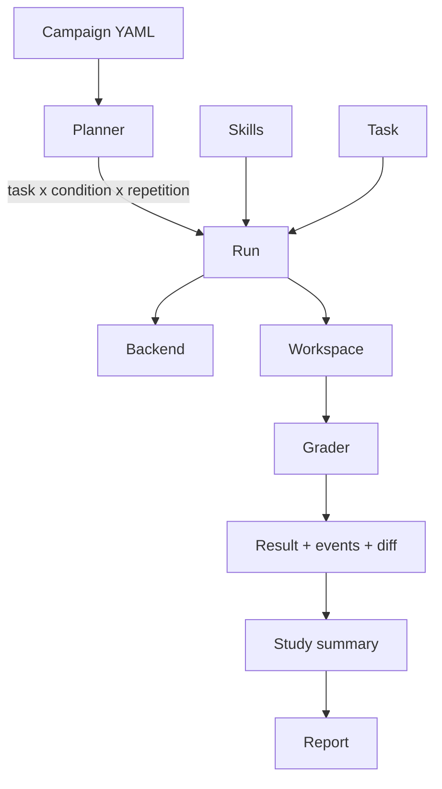

# Core ideas

Ten words carry the whole project. Learn these and everything else reads easily.

## Skill

A folder containing a `SKILL.md` (YAML frontmatter plus Markdown instructions) and optional reference files. It is the thing being tested. Squelch fingerprints every file in it, so any edit changes the skill's identity. See [write a skill](../guides/write-a-skill.md).

## Task

A small, self-contained coding exercise: a prompt (what the agent is told), a `starter/` folder (the files it begins with), and rules for what counts as output. Examples: fix an off-by-one, migrate to a new API, make a parser tolerate bad input. See [write a task](../guides/write-a-task.md).

## Grader

A separate, trusted Python script that inspects the agent's final files and prints pass/fail per requirement. **The agent never sees it.** See [evaluation](../architecture/evaluation.md).

## Assertion

One requirement a grader checks ("`config.json` parses", "the port is in range", "no unrelated files were created"). A task succeeds only if **every mandatory assertion** passes.

## Condition

A named choice of which skills the agent is given, and in what order. The canonical set is `none`, `a`, `b`, `ab`. See [experiment design](./experiment-design.md).

## Run

One task, executed once, under one condition, from a fresh workspace. Everything about it is recorded: an ordered event trace, a diff of what changed, and a graded result.

## Study (or campaign)

The full grid of runs: tasks x conditions x repetitions, planned from a YAML config. The config *is* the experiment recipe. See [campaigns](../architecture/campaigns.md).

## Backend

The "brain" that answers the agent loop. Two exist:

- **`scripted`**: a deterministic puppet that replays a JSON transcript. Free and repeatable. Used to test the harness itself.
- **`ollama`**: a real model running locally.

Both implement one interface, so the runner cannot tell them apart. See [backends](../architecture/backends.md).

## Workspace

The folder the agent may read and write. It is rebuilt from the task's starter files for every run, so nothing leaks between runs.

## Evidence stage

Every result is labelled `scripted`, `screening`, `confirmation`, or `external_replication`. A scripted result validates the program, never a model. A screening result is small-N and descriptive. Nothing is promoted between stages automatically.

## How they fit

