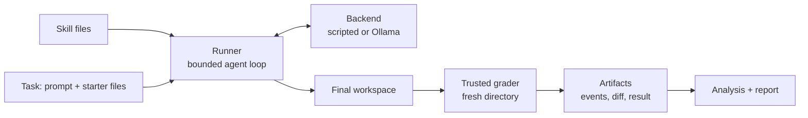

# What is Squelch?

In radio, the *squelch* circuit suppresses unwanted noise on a channel so the signal comes through cleanly. Agent skills that each work correctly alone can interfere when loaded together. Squelch is an open-source experimental system that **measures that interference** and tests whether **rearranging how instructions are applied** suppresses it.

:::caution Status: work in progress
Phase 1 (the instrumented laboratory) is built and tested. **No validated research finding exists yet.** The first live pilot is described honestly, including what failed, in [Pilot 001 results](./results/pilot-001.md).
:::

## The question

An *agent skill* is a package of instructions (a `SKILL.md` plus optional resources) that you hand to a coding agent. Each skill might be good advice on its own:

> "Touch only what the task requires."
> "When you touch a file, clean it up properly: types, structure, the works."

Loaded together, those two point in opposite directions. What does the agent do? Does it get worse than with either alone? And if it does, can you fix it *without rewriting the skills*, just by changing how they're applied: in a different order, in separate phases, or in separate context windows?

The long-term question behind all of it: **can an agent maintain useful expertise without accumulating conflicting or obsolete instructions?**

## The hypotheses

- **Primary.** When two individually useful skills degrade agent behavior in combination, changing how their instructions are applied (ordering, phase separation, or context isolation) can preserve more of their individual benefit than loading both together or removing one.
- **Secondary.** A composition decision is conditional on task family, model, and skill version, and becomes stale when those change.

Both are hypotheses to evaluate, not established claims.

## How an experiment works

Every task is run under several **conditions**. To ask whether skills A and B interfere, you need four:

| Condition | Skills the agent is given |
|---|---|
| `none` | nothing (the baseline) |
| `a` | skill A alone |
| `b` | skill B alone |
| `ab` | both, in a declared order |

Comparing only `ab` against `none` can't distinguish "the pair is bad" from "either one is bad". If `ab` scores below **both** `a` and `b`, that is a candidate conflict, and only a candidate: see [experiment design](./concepts/experiment-design.md) for why.

## Five questions Squelch is built to answer

1. Does a skill help on these tasks in this environment?
2. Does its effect change when another skill is present?
3. Can ordering, phase separation, or isolated contexts improve the combination?
4. Does that finding survive unseen tasks, a different model, or a skill edit?
5. Should a candidate configuration be admitted, deferred, or reverted?

## What exists today

| Phase | Increment | Status |
|---|---|---|
| 1 | Instrumented laboratory and a reproducible constructed conflict | **Built.** Research exit criteria partly unmet, see [results](./results/pilot-001.md) |
| 2 | Contextual interaction map: do skills nobody designed to conflict interfere? | Planned |
| 3 | Composition experiment engine: shared vs phased vs isolated, with control arms | Planned |
| 4 | Generalization and staleness harness | Planned |
| 5 | Lifecycle workbench: candidate, experiment, decision, rollback | Planned |

See the [roadmap](./roadmap.md) for detail and for the known gaps in what is built.

## Who this is for

- **Skill authors** checking whether a change helps its target workflow and harms neighbouring ones.
- **Developers** maintaining a small skill collection for a coding agent.
- **Researchers** comparing instruction-composition strategies with inspectable experiments.

## Where to go next

- New here? Run the [offline demo](./getting-started/quickstart.md). No API key, no network.
- Want the vocabulary? [Core concepts](./concepts/core-ideas.md).
- Want to see how it's built? [Architecture overview](./architecture/overview.md).
- Want the evidence? [Pilot 001](./results/pilot-001.md) and the [methodology](./methodology.md).
